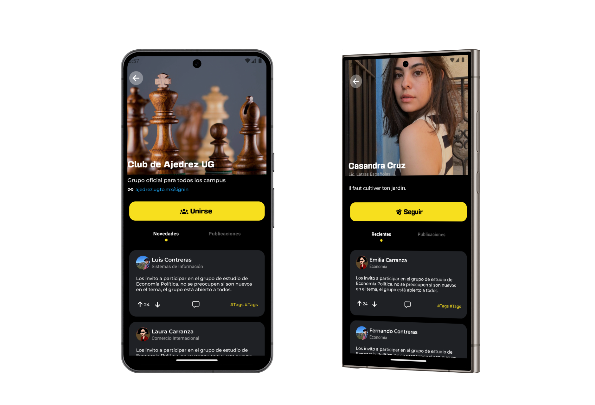

  In the dynamic landscape of university communities, fostering seamless
  communication and connectivity among students, faculty, and the broader
  university ecosystem is paramount. Introducing UG Groups – the pioneering
  social network app meticulously crafted to unite the vibrant community of
  Universidad de Guanajuato. Powered by the unparalleled synergy of React Native
  and Expo, UG Groups redefines the way students, teachers, and university
  affiliates interact, collaborate, and engage.{" "}
   (There's still Work in progress...) 

  

    
  

  

    
  

  

    

      <h2
        style={{ "font-family": "Telegraf", "font-style": "bold" }}
        class="text-3xl md:text-4xl md:text-center font-bold translate-x-2 translate-y-2"
      >
        Why this stack?
      </h2>
    

  

  

    Expo accelerates the development cycle, enabling rapid prototyping,
    streamlined testing, and efficient deployment of UG Groups. By leveraging
    Expo's extensive library of pre-built components, APIs, and development
    tools, our team at Universidad de Guanajuato has been able to focus on
    crafting rich user experiences and innovative features without the overhead
    of platform-specific complexities. The result? A feature-rich social network
    app that's not just robust but also incredibly agile in adapting to evolving
    user needs and market trends.
  

  

    As Universidad de Guanajuato embarks on a journey of digital transformation,
    UG Groups stands at the forefront – a beacon of innovation, empowerment, and
    unity. By harnessing the unparalleled capabilities of React Native and Expo,
    we've not just built a social network app but rather a digital hub that
    encapsulates the spirit, diversity, and vibrancy of our university
    community. Together, let's redefine the way we connect, collaborate, and
    thrive – with UG Groups leading the way towards a brighter, more
    interconnected future for Universidad de Guanajuato.
  

