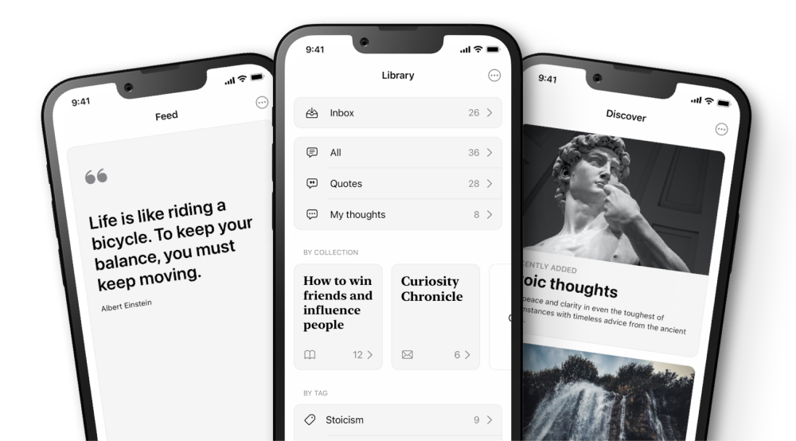

  Medizona emerges as a pioneering force, revolutionizing the doctor-patient
  experience in Mexico. At the heart of our mission lies a commitment to
  bridging the gap between healthcare providers and patients, while equipping
  doctors with cutting-edge tools to streamline their workflows. Enter our iOS
  and Android app clients – meticulously crafted with React Native and Expo – a
  testament to our unwavering dedication to innovation, accessibility, and
  user-centric design.

  

    
  

  

    
  

  

    
  

  

    
  

  

    

      <h2
        style={{ "font-family": "Telegraf", "font-style": "bold" }}
        class="text-3xl md:text-4xl md:text-center font-bold translate-x-2 translate-y-2"
      >
        Why this stack?
      </h2>
    

  

  

    With React Native as our cornerstone, Medizona's app transcends platform
    boundaries, delivering a seamless and consistent experience across iOS and
    Android devices. Whether you're accessing the app from an iPhone or an
    Android handset, our users benefit from a unified interface, feature parity,
    and uncompromising performance, ensuring accessibility and inclusivity for
    patients and doctors alike, regardless of their preferred device.
  

  

    At its core, Medizona's app is more than just a platform – it's a catalyst
    for fostering meaningful connections, empowering patients to take control of
    their healthcare journey, and equipping doctors with the tools they need to
    deliver personalized care. Through intuitive appointment scheduling, secure
    messaging, and telemedicine capabilities, our app facilitates seamless
    communication and collaboration between doctors and patients, transcending
    geographical barriers and empowering individuals to prioritize their health
    and well-being.
  

